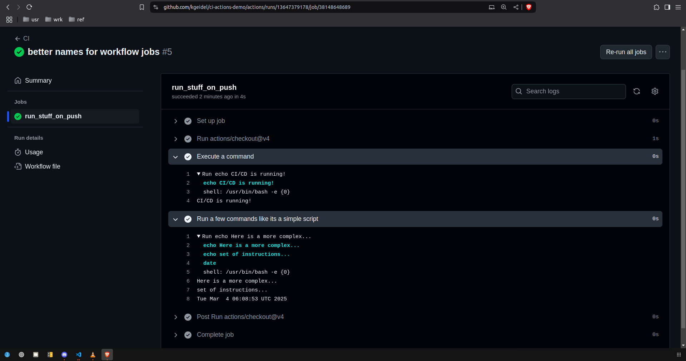

## MSDS434 Module 10: Github CI actions demonstration

An experiment to test CI/CD principles using Github actions.

I am in section 55 (Winter '25.) This is my week 10 demonstration. <br>
Please visit my [Google Drive Folder](https://drive.google.com/drive/folders/1so_fM2HcdTYzCYSuwtdbxBeXtx1CPN8J?usp=sharing) for the weekly demonstration videos.

### Replication

```shell
# Fork the repo (you wont be able to push to my repo w/o a pull request) 
# Once you have your own repo SSH url replace mine below.
# Clone your fork and enter the repo
git clone git@github.com:kgeidel/ci-actions-demo.git && cd ci-actions-demo

# Make sure the script is executable
chmod u+x some_script.sh

# Run the script as is...
./some_script.sh

# Now make some changes to the script...
# For example, append an echo command:
echo "echo SOME TEXT THAT WILL BE RECOGNIZED AS NEW" >> some_script.sh

# re-run the script to confirm the changes are present
./some_script.sh

# Push the changes to trigger the CI action
git add *
git commit -m "Changes that should trigger CI"
git push

```

### Testing CI/CD pipeline

If all is properly configured, on push, a Github action with the name "CI" should run. There is one job in the CI workflow: run_stuff_on_push and in that one job are three steps.
1) Checkout the codebase on an ubuntu container
2) Run a single command (a simple print)
3) Run multiple lines of commands (some prints and a timestamp)

The workflow will clean up its own resources afterwards. Viewing the commits in the Github actions pane allows you to see the job status and output of each step.



### Troubleshooting

* Did you fork the example repo? Or are you trying to push to mine?
* Are you on a system with bash or similar shell?
* Did you need to escape a character in your added echo command?
* Try editing the shell script in an editor if you are picking up unescaped characters using the append by redirect (`>>`).
* Is your git configured for pushing/pulling? Credentials in place?
